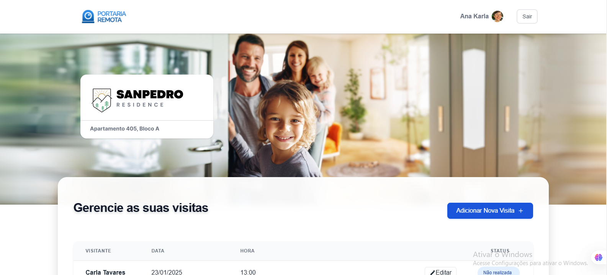
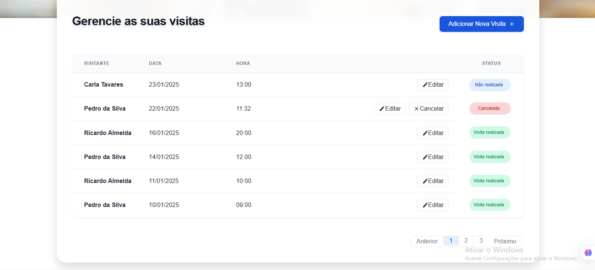
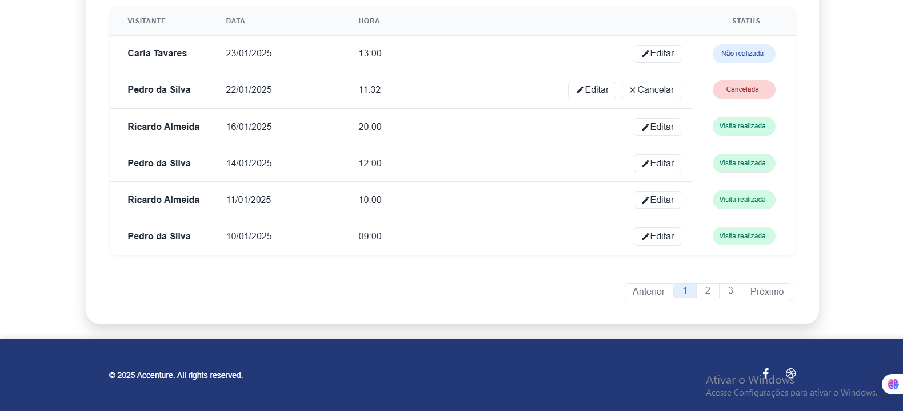

# Portaria Remota

Uma interface intuitiva para gerenciar visitas com uma tabela moderna e funcional , status visualmente ricos em design minimalista e moderno. Ideal para sistemas de controle de acesso ou agendas.



## ✨ Funcionalidades Principais
- **Tabela dinâmica** com efeitos hover e rolagem suave  
- **Status coloridos** (Realizada, Cancelada, Não realizada)   
- Efeitos de transição suaves  

## 🛠 Tecnologias  
- **React + Vite**  
  Frontend desenvolvido com React para componentes dinâmicos e Vite como ferramenta de build (HMR, ES modules e otimizações).  

- **CSS Moderno**  
  Layouts com Flexbox/Grid, variáveis CSS (`:root`) e efeitos de transição suaves.  

---
## 📸 Screenshots

### 1. Header 
  
*Interface principal do site*

---

### 2. Tabela
  
*Tabela principal com um layout minimalista e intuitiva*

---

### 3. Footer
  
*Footer com um layout simples e moderno*

## 🚀 Como Usar
1. Clone o repositório:
```bash
git clone https://github.com/Devaks99/PortariaRemota.git
cd portaria
npm install
npm run dev
